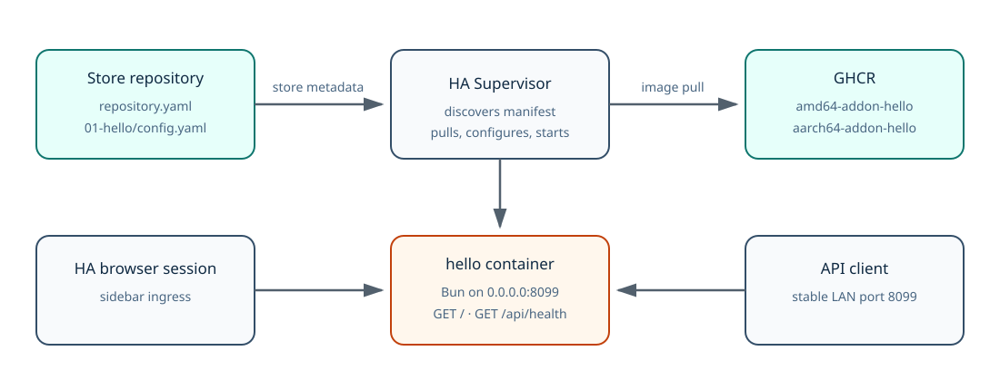
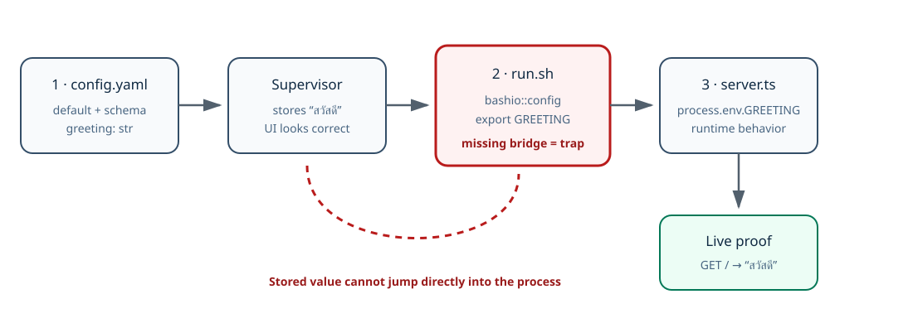
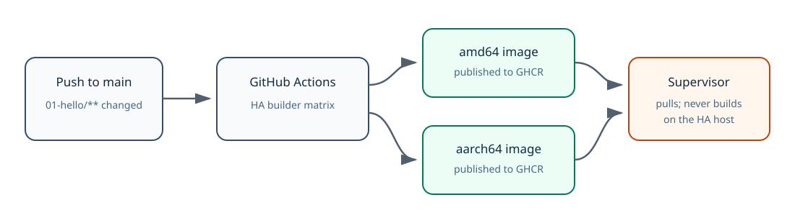

# Worked Example 01 — Build `hello` From Store Metadata to Live HTTP

This is the complete construction and verification path for [`01-hello/`](../01-hello/).
It is a worked example, not an abstract specification: every referenced file is
present in this repository, and the runtime endpoint proof was executed with a
non-default greeting.

> This walkthrough proves repository structure, configuration flow, YAML and
> shell validity, and the Bun HTTP behavior. It does **not** claim that this
> repository has already been added to a Home Assistant instance or that its
> images have already been published. Those external steps remain explicit.

## The finished system



The root repository is a **store**. `01-hello/` is one independently installable
**add-on** inside it. The directory prefix gives readers an order; the installed
slug remains `hello`.

---

## Step 1 — Create the store identity

File: [`repository.yaml`](../repository.yaml)

```yaml
name: "Oracle HAOS Factory"
url: "https://github.com/Soul-Brews-Studio/oracle-haos-factory"
maintainer: "Soul Brews Studio <oracle@laris.co>"
```

Supervisor reads this root file when a user adds the repository URL. It does not
run a container. Its job is to identify the store that contains add-ons.

**Proof:** parse it as YAML and confirm the URL matches the Git remote.

```bash
yq eval '.' repository.yaml >/dev/null
git remote get-url origin
```

---

## Step 2 — Give the example a reading-order directory and a stable slug

Directory: [`01-hello/`](../01-hello/)

The repository began with `hello/`, then moved to `01-hello/` when the concept
expanded from one add-on into a teaching factory. Every path-bearing surface had
to move with it:

- `config.yaml` source URL
- `build.yaml` source label
- GitHub Actions path filter
- Home Assistant builder `--target`

The add-on identity did **not** change:

```yaml
slug: "hello"
```

Directory names organize the source tree; slugs are the stable Supervisor/API
identity. Renaming one does not require renaming the other.

---

## Step 3 — Write the Supervisor contract

File: [`01-hello/config.yaml`](../01-hello/config.yaml)

This file establishes all six factory rules:

1. A pullable prebuilt image for both advertised architectures.
2. Automatic boot with the Home Assistant base image owning init.
3. Sidebar ingress plus a stable LAN/API port.
4. `/data` as the persisted and backed-up mount.
5. `str` for strings that can be empty; never `url?` with an empty default.
6. The first of three option edits: declare `greeting` and its schema.

Critical shape:

```yaml
image: "ghcr.io/soul-brews-studio/{arch}-addon-hello"
arch: [amd64, aarch64]
boot: auto
init: false

ingress: true
ingress_port: 8099
ports:
  8099/tcp: 8099

map:
  - data:rw

options:
  greeting: "hello"
schema:
  greeting: str
```

Read the comments in the real file. They explain observed failure modes rather
than restating field names.

---

## Step 4 — Define per-architecture build bases

File: [`01-hello/build.yaml`](../01-hello/build.yaml)

```yaml
build_from:
  amd64: ghcr.io/home-assistant/amd64-base:3.22
  aarch64: ghcr.io/home-assistant/aarch64-base:3.22
```

The official builder supplies `BUILD_FROM` and `BUILD_ARCH`. Do not override
`BUILD_ARCH` with the literal template text `{arch}`; the Dockerfile's
architecture switch would receive exactly that string and reject it.

The tags here stay aligned with the Dockerfile's digest-pinned 3.22 default so a
local build and CI build do not silently test different base generations.

---

## Step 5 — Build an immutable Home Assistant add-on image

File: [`01-hello/Dockerfile`](../01-hello/Dockerfile)

The Dockerfile:

1. Starts from a digest-pinned Home Assistant 3.22 base for plain local builds.
2. Accepts the builder's per-architecture `BUILD_FROM` override.
3. installs the **musl** Bun binary required by Alpine.
4. Rejects architectures not advertised by the manifest.
5. Sets `HOME=/data` so future home-derived state survives updates and backups.
6. Copies only `server.ts` and `run.sh`.
7. leaves s6-overlay as the base image's init and starts `/run.sh` as the command.

Local build proof for one architecture:

```bash
docker build --platform linux/amd64 -t oracle-haos-factory/hello ./01-hello
```

A successful local build proves the Dockerfile. It does not prove that GHCR has
both public architecture tags; CI and an anonymous pull must prove that later.

---

## Step 6 — Bridge the option through `run.sh`

File: [`01-hello/run.sh`](../01-hello/run.sh)



This is the step that is easiest to omit because Supervisor already displays and
stores the option correctly.

```bash
GREETING="$(bashio::config 'greeting')"
[ "${GREETING}" = "null" ] && GREETING="hello"
export GREETING
```

The bridge also ends with:

```bash
exec bun /app/server.ts
```

`exec` makes Bun receive s6 stop signals directly. Without it, a shell remains
between Supervisor and the application and can delay restarts until a kill
timeout.

**Static proof:**

```bash
bash -n 01-hello/run.sh
rg "bashio::config 'greeting'|export GREETING" 01-hello/run.sh
```

`run.sh` cannot be executed directly outside Supervisor because `bashio::config`
queries Supervisor-owned configuration. Plain Docker/runtime tests therefore
bypass the entrypoint and inject the environment variable directly.

---

## Step 7 — Read the environment in application code

File: [`01-hello/server.ts`](../01-hello/server.ts)

This is the third option edit:

```ts
const greeting = process.env.GREETING ?? "hello";
```

The server binds to `0.0.0.0:8099`, not loopback, so both ingress and the mapped
LAN port can reach it. It exposes:

| Request | Response |
|---|---|
| `GET /` | The configured greeting as UTF-8 plain text |
| `GET /api/health` | `{"status":"ok","greeting":"…"}` |
| Anything else | HTTP 404 |

A non-default value is essential proof. Testing only `hello` cannot distinguish
an intact bridge from a broken bridge whose code fell back to the same default.

---

## Step 8 — Publish prebuilt images instead of building on HAOS

File: [`.github/workflows/builder.yml`](../.github/workflows/builder.yml)



The workflow runs when `01-hello/**` changes and invokes Home Assistant's builder
for both architectures:

```text
--target 01-hello
--image {arch}-addon-hello
--docker-hub ghcr.io/soul-brews-studio
--addon
```

This must stay synchronized with `config.yaml`:

```text
ghcr.io/soul-brews-studio/{arch}-addon-hello
```

If the workflow still targeted the old `hello/` directory after the rename, CI
would not build the example. If the image name drifted, CI could succeed while
Supervisor pulled a different or nonexistent package.

---

## Step 9 — Validate the repository contract

From the repository root:

```bash
yq eval '.' \
  repository.yaml \
  01-hello/config.yaml \
  01-hello/build.yaml \
  .github/workflows/builder.yml >/dev/null

bash -n 01-hello/run.sh

test "$(yq -r '.image' 01-hello/config.yaml)" \
  = 'ghcr.io/soul-brews-studio/{arch}-addon-hello'
test "$(yq -r '.arch | join(",")' 01-hello/config.yaml)" \
  = 'amd64,aarch64'
test "$(yq -r '.boot' 01-hello/config.yaml)" = auto
test "$(yq -r '.init' 01-hello/config.yaml)" = false
test "$(yq -r '.ingress' 01-hello/config.yaml)" = true
test "$(yq -r '.ports."8099/tcp"' 01-hello/config.yaml)" = 8099
test "$(yq -r '.map[0]' 01-hello/config.yaml)" = data:rw
test "$(yq -r '.schema.greeting' 01-hello/config.yaml)" = str
```

This proves the declared contract. It does not start the application.

---

## Step 10 — Prove the application with a non-default greeting

This exact shape was used to test the Bun server independently of Supervisor:

```bash
PORT=18099 GREETING='hello from Supervisor' bun 01-hello/server.ts
```

In another terminal:

```bash
curl -fsS http://127.0.0.1:18099/
# hello from Supervisor

curl -fsS http://127.0.0.1:18099/api/health
# {"status":"ok","greeting":"hello from Supervisor"}
```

This proves the application consumes `GREETING`; the static `run.sh` check proves
the bridge exports it. A real Supervisor installation is the final integrated
proof of the entire chain.

---

## Step 11 — Install and verify on Home Assistant

A green workflow is not the installation gate. Before these external steps,
the **consumer** must be able to reach every artifact anonymously:

1. The GitHub store repository is public and cloneable without credentials.
2. Both GHCR architecture packages are public.
3. An anonymous registry probe returns `200` for each package:

```bash
curl -sS -o /dev/null -w '%{http_code}' \
  https://ghcr.io/v2/soul-brews-studio/aarch64-addon-hello/tags/list
```

`401` means private; `404` means the image or tag is absent. Repeat for
`amd64-addon-hello`. Only after both return `200` should Supervisor consume the
store:

```bash
just thor-addons add-repo https://github.com/Soul-Brews-Studio/oracle-haos-factory
just thor-addons list
just thor-addons install <repository-hash>_hello
```

Then set a deliberately non-default greeting through the Supervisor API as a
**complete option set**, restart, and prove both doors:

```bash
just thor-addons restart <repository-hash>_hello
just thor-addons logs <repository-hash>_hello
curl -fsS http://thor-host:8099/
curl -fsS http://thor-host:8099/api/health
```

Also open the sidebar ingress page. A LAN 200 does not prove ingress, and an
ingress page does not prove the stable API port.

Verify the **running version** after install/update. A successful Supervisor
command proves the request was accepted, not that the intended image is running.

---

## Step 12 — Diagnose by symptom, not guesswork

Use [`TRAPS.md`](../TRAPS.md). Its seven sections begin with the symptom a reader
actually sees:

1. update reported success but the old version remains;
2. reboot leaves the add-on stopped or lifecycle handling is wrong;
3. sidebar works but API clients cannot connect;
4. data disappears after update or restore;
5. the container never exists and its log is empty;
6. Supervisor stores an option while the process behaves as if it is unset;
7. CI is green but anonymous Supervisor cannot find the store or pull the image.

Trap 6 maps directly to the option-flow diagram above. If stored options are
correct but runtime behavior is wrong, inspect `run.sh` before rewriting the
schema or application parser.

## Completion evidence captured for this example

- Store and add-on YAML parsed successfully.
- `slug: hello` remained stable after `hello/` became `01-hello/`.
- CI filters and builder target moved to `01-hello`.
- The image contract remained `{arch}-addon-hello` for amd64 and aarch64.
- All six manifest rules passed static assertions.
- Artifact visibility is explicitly a consumer-side prerequisite; CI success alone is not counted as installability proof.
- `run.sh` passed shell syntax validation and contains the `greeting` bridge.
- The Bun server returned a non-default greeting at `/`.
- `/api/health` returned matching JSON state.
- No commit or push was performed as part of the reviewed scaffold work.
