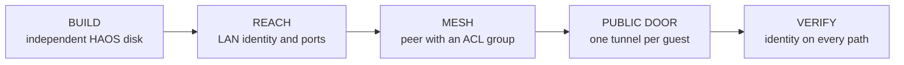

# Provision a Guest for Home Assistant Add-ons

> **Public-repository boundary:** real hosts, guest addresses, usernames, domains,
> credentials, setup keys, tunnel tokens, and fleet-specific recipe values live in a
> **private repository**. This guide uses placeholders throughout. Do not replace them
> with real infrastructure values in this repository.

An add-on does not run in the store repository. It runs under Home Assistant
Supervisor on a guest, so the guest is part of the add-on delivery chain. The safe
path is four gated phases: build the guest, prove local reachability, join the private
mesh, and give that guest its own public tunnel.



The commands below are recipe interfaces, not invitations to reproduce their shell
internals by hand. A recipe is valuable because a refusal exits non-zero and stops the
chain before a later destructive or misleading step can run.

## Before starting

- Run the recipes from the private KVM automation repository.
- Point its host setting at `<your-host>` without recording the real value here.
- Choose a new `<guest-name>`, `<memory-mib>`, and `<vcpus>`.
- Keep every password, NetBird setup key, and Cloudflare tunnel token in a mode-`600`
  file. Pass the **file path** to recipes; never put secret contents in argv, shell
  history, a Just variable, or this document.
- Treat any refusal as a successful safety gate. Fix its cause, then rerun the recipe;
  do not bypass it with an ad-hoc command.

## Phase 1 — BUILD

### Recipe

```bash
HAOS_HOST=<your-host> just build <guest-name> <memory-mib> <vcpus>
```

Interface form:

```text
just build NAME MEM CPUS
```

`build` deliberately stops at the first non-zero result and chains these recipes in
order:

```text
preflight -> verify-image -> copy -> bake-hostname -> define -> address
```

### Measured evidence from a real build

This chain was rerun end to end for a new guest at **2048 MiB / 2 vCPU**. The real guest,
host, network, and address remain in the private repository; they are represented here as
placeholders.

One `just build <guest-name> 2048 2` invocation produced, in order:

- tooling present;
- `<guest-name>` free;
- no orphaned NVRAM;
- `<libvirt-network>` active;
- sufficient free disk space;
- hostname baked before first boot;
- domain defined with UEFI and `secure-boot` explicitly disabled;
- autostart enabled;
- the Open vSwitch virtual port present in the domain XML; and
- `<guest-ip>` resolved by ARP, not `virsh domifaddr`.

This is evidence for the chain as a unit: the caller did not manually bridge gaps between
steps, and any refusal would have stopped the one command before the remaining steps ran.

### What each step protects

1. **`just preflight <guest-name>`** checks the host before any guest disk is created.
   It refuses when required virtualization tooling or UEFI firmware is missing, when
   the name is already present in `virsh list --all` (including a powered-off domain),
   when an orphaned UEFI variable store would be inherited by the new domain, when the
   selected libvirt network is absent or stopped, or when the target filesystem has
   less than 40 GiB free. These checks prevent a partial guest whose name, firmware,
   network, or storage was invalid before construction began.

2. **`just verify-image`** proves the base is HAOS rather than trusting its filename.
   It refuses unless the virtual size is exactly 32 GiB and the partition labels include
   `hassos-*`. Size is only a heuristic; the labels are the positive identity check. It
   also needs a free NBD device to inspect those labels and must release that device on
   every exit path—a leaked attachment otherwise makes later builds fail with an opaque
   error.

3. **`just copy <guest-name>`** creates an independent sparse copy of the pristine base;
   it does **not** create a qcow2 overlay. HAOS rewrites its A/B operating-system
   partitions during OTA updates. An overlay would leave the guest permanently dependent
   on an unchanged backing file while its OS blocks diverge; moving, replacing, or
   modifying that backing file can corrupt every child. A full sparse copy lets this
   guest update independently and keeps the pristine base reusable.

4. **`just bake-hostname <guest-name>`** writes the guest identity before first boot and
   refuses to modify a running guest. If multiple fresh HAOS guests first boot with the
   default name, collision handling can rename one nondeterministically. Baking the name
   first makes later discovery and identity checks deterministic.

5. **`just define <guest-name> <memory-mib> <vcpus>`** imports the copied disk with UEFI
   and explicitly disables Secure Boot. HAOS requires UEFI but refuses Secure Boot; an
   importer that silently enables it produces a domain that never reaches HAOS, DHCP, or
   useful guest logs. The recipe also attaches the selected bridged network and enables
   autostart rather than leaving those as UI defaults.

6. **`just address <guest-name>`** is the final build step. It refuses if the domain has
   no bridged interface or if no address appears within the bounded discovery window.
   The next phase explains why this is an ARP lookup rather than `virsh domifaddr`.

Do not continue merely because a domain exists. BUILD is complete only when the chain
prints an address for `<guest-name>` and every earlier gate has passed.

## Phase 2 — REACH

### Recipes

```bash
HAOS_HOST=<your-host> just address <guest-name>
HAOS_HOST=<your-host> just probe <guest-ip>
```

`address` reads the guest's bridged NIC MAC and finds that MAC with ARP on the LAN.
`virsh domifaddr` is the wrong instrument here: the physical LAN router, not libvirt's
DHCP service, owns the lease, so libvirt has no authoritative lease record to return.

`probe` checks all four meaningful HAOS ports:

| Port | Why it is checked |
|---|---|
| `80` | HAOS can move the Home Assistant UI here immediately after onboarding. |
| `8123` | The fresh guest commonly answers here before that onboarding transition. |
| `4357` | Supervisor's observer can answer while Home Assistant Core is still booting. |
| `22222` | The supported host debug/SSH surface, when explicitly enabled. |

```text
Do not reduce the probe to 8123.
```

A healthy guest can answer on `8123`, switch to `80`, and then leave `8123` closed. A
single-port probe therefore turns a known lifecycle transition into a false outage.
Likewise, an immediate connection refusal means nothing is listening on that port; a
service that is still starting normally times out instead.

Record the discovered value only in the private per-guest recipe as `<guest-ip>`. Do not
publish it in this vault.

## Phase 3 — MESH

### Recipe pattern

The private post-build justfile supplies one credential-safe recipe per guest:

```bash
just <guest-name>-netbird <setup-key-file>
```

That recipe must:

1. refuse an absent or empty `<setup-key-file>`;
2. add the NetBird add-on repository idempotently, because a fresh guest does not have it;
3. install the NetBird add-on;
4. read the setup key from the file at runtime rather than placing it in argv;
5. configure the peer name as `<guest-name>` and the management endpoint as
   `<netbird-management-url>`;
6. restart the add-on after writing options; and
7. verify the assigned mesh label from another authorized peer.

### The successful-but-unreachable trap

A setup key without an automatic ACL group can join successfully while the new peer
remains unreachable. The join proves registration, not authorization. The peer's log may
show zero applicable rules even though the dashboard lists it as connected.

Create a short-lived, one-use setup key whose auto-group is `<authorized-acl-group>`.
After joining, read the peer's **actual assigned mesh label**—do not assume it equals
`<guest-name>`—and prove a guest-specific endpoint through:

```bash
curl -fsS http://<mesh-label>:<addon-port>/api/health
```

The response must contain `<guest-name>` or another unique guest identity. HTTP success
alone is deferred to VERIFY because it cannot prove which machine answered.

## Phase 4 — PUBLIC DOOR

### Recipe pattern

Create a new Cloudflare tunnel for this guest in the authorized dashboard, store its token
in a mode-`600` file, then run the private per-guest recipe:

```bash
just <guest-name>-tunnel <tunnel-token-file>
```

That recipe must:

1. refuse an absent or empty `<tunnel-token-file>`;
2. add the cloudflared add-on repository idempotently;
3. install the cloudflared add-on;
4. read this guest's token from the file and write the complete option set;
5. restart after configuration—the install may start once before a token exists and remain
   in an error state until restarted; and
6. leave creation of `<public-domain>` and its published route to the authorized
   Cloudflare operator.

### One tunnel per guest—never share a token

A tunnel token is a tunnel identity, not merely permission to reach Cloudflare. Reusing
one token on two guests creates two connectors for the **same** tunnel. Cloudflare may
then load-balance one hostname across both machines. The result looks like intermittent
data loss or a nondeterministic application bug: repeated requests to one URL actually
reach different guests with different state.

The invariant is:

```text
one guest -> one tunnel -> one token -> that guest's routes
```

Do not copy an existing guest's token. Create `<guest-tunnel>`, route
`<public-domain>` to the intended service on `<guest-name>`, and verify the connector and
application identity independently.

## VERIFY — prove every door by identity

### Recipe pattern

The private per-guest justfile should expose one aggregate check:

```bash
just <guest-name>-paths
```

It should probe at least:

| Door | Placeholder target | Required proof |
|---|---|---|
| LAN | `http://<guest-ip>:<addon-port>/api/health` | Response identifies `<guest-name>`. |
| Mesh | `http://<mesh-label>:<addon-port>/api/health` | Same identity through an authorized peer. |
| Public HA | `https://<public-ha-domain>/` | Expected Home Assistant signature for this guest. |
| Public add-on | `https://<public-addon-domain>/api/health` | Add-on health plus this guest's unique identity. |

An HTTP `200` proves only that **something** answered. It does not prove DNS selected the
intended tunnel, the tunnel selected the intended connector, or the connector reached the
intended guest. This is especially important after tunnel work: a reused token can return
perfectly healthy `200` responses from the wrong machine.

Use a stable identity field such as `instance`, `name`, `replica`, or another deliberately
unique health signature. Compare the content across LAN, mesh, and public paths. The guest
is provisioned only when every door returns the same intended identity—not merely the same
status code.
